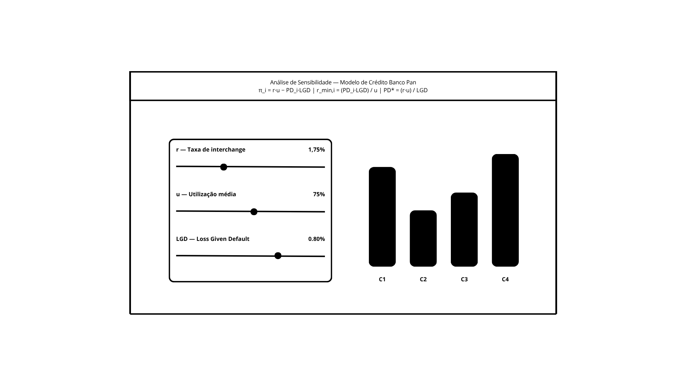

# Microinterface — Análise de Sensibilidade do Modelo de Crédito (Banco Pan / BTG)

## 1. Introdução à proposta

Este projeto é uma **microinterface interativa** desenvolvida com **p5.js**, concebida como um painel de controle e visualização do modelo matemático de otimização de limite de crédito do projeto com o Banco Pan/BTG.

O modelo base relaciona três parâmetros de negócio — a **taxa de interchange (r)**, a **utilização média do cartão (u)** e a **perda dado o default (LGD)** — às probabilidades de inadimplência individuais de cada segmento de cliente (**PD_i**), calculando o lucro esperado por cliente e os limites críticos de viabilidade.

### Fórmulas implementadas

| Fórmula | Descrição |
|---|---|
| `π_i = r·u − PD_i·LGD` | Lucro líquido esperado por cliente i |
| `r_min,i = (PD_i·LGD) / u` | Taxa mínima de interchange para break-even |
| `PD* = (r·u) / LGD` | Probabilidade de default máxima tolerável |

### Por que essa proposta?

A microinterface transforma um modelo matemático abstrato em uma experiência visual e interativa, permitindo que analistas de crédito e gestores entendam **em tempo real** como cada parâmetro afeta a lucratividade dos clientes. É um painel de controle e ajuste do algoritmo de decisão, exatamente o tipo de ferramenta de suporte à tomada de decisão que o projeto propõe.

---

## 2. Rascunhos iniciais

### Conceito visual

A proposta parte da referência desenvolvida no canva com base em conversas com o grupo em momentos anteriores (imagem_rascunho.png) e evolui para uma interface de alta fidelidade com:

- **Fundo escuro com grid e partículas flutuantes** — cria sensação de sistema vivo e dinâmico
- **Painel de parâmetros** à esquerda com 3 sliders interativos (r, u, LGD)
- **Gráfico de barras animado** à direita, uma barra por segmento de cliente (C1–C4)
- **Tooltips detalhados** ao passar o mouse sobre cada barra
- **Painel de resultados** com PD* e classificação de clientes por lucratividade

### Esboço de layout



## 3. Registro do resultado obtido

### O que a interface faz

1. **Sliders interativos**: Ao mover os controles de `r`, `u` e `LGD`, todos os cálculos são refeitos em tempo real a cada frame do loop `draw()`.

2. **Gráfico de barras em tempo real**: Uma barra por segmento de cliente (C1–C4). A altura é proporcional ao valor absoluto do lucro esperado `π_i`, normalizada pelo maior valor absoluto do conjunto.

3. **Coloração semântica**: Barras **verdes** indicam cliente lucrativo (π ≥ 0); barras **vermelhas** indicam prejuízo (π < 0). A cor muda dinamicamente conforme os parâmetros variam.

4. **Painel de controles**: Caixa com os três sliders (r, u, LGD) e o valor atual de cada parâmetro exibido numericamente em percentual.

5. **Linha de base (break-even)**: Linha horizontal marca o `π = 0`, facilitando a leitura visual de quais segmentos estão acima ou abaixo do ponto de equilíbrio.

### Aprendizados e decisões técnicas

- Os sliders HTML nativos são pareados ao `#canvas-container` (que tem `position: relative`) e posicionados com coordenadas relativas ao canvas, garantindo alinhamento correto mesmo quando o canvas é centralizado via flexbox.
- Toda a lógica de negócio (fórmulas do modelo) está desacoplada da lógica de renderização.

### Como rodar

```bash
# Clonar o repositório e abrir com live server, ou simplesmente:
open index.html
# (ou usar extensão Live Server no VS Code)
```

---
